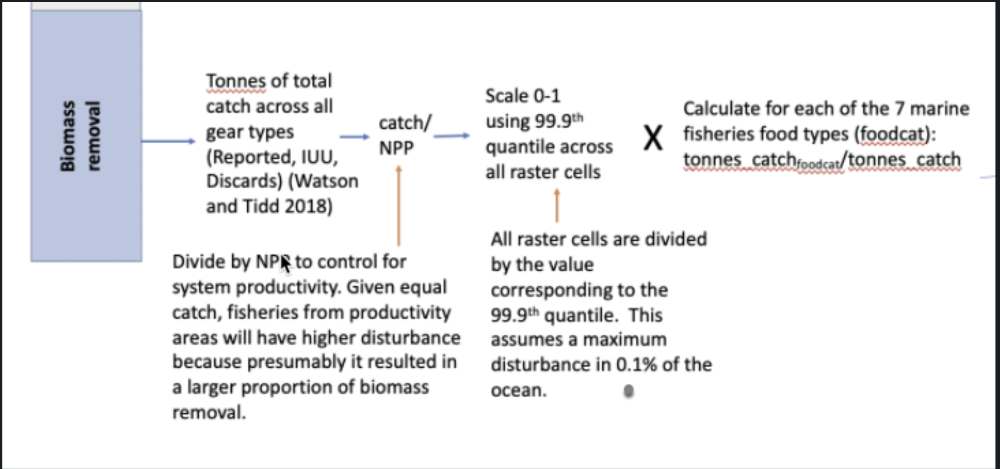

This script will be used to complete these methods to estimate biomass removal for marine fisheries: 



1. Read in raster of all catch for all gear types
2. Divide that catch by the gapfilled NPP raster from STEP1.
3. Scale the divided raster to the 99.9th quantile. 
4. Multiply that raster by each of rasters created in STEP4a_rasters.Rmd and save each raster. 

```{r, eval = FALSE}
#load relevant packages, etc.

library(here)
library(raster)
library(tidyverse)
library(doParallel)
library(foreach)
library(parallel)

# raster template
r <- raster::raster(ncol=720, nrow=360, vals=c(1:259200))
food_raster <- raster(nrows=2160, ncols=4320, xmn=-180, xmx=180, ymn=-90, ymx=90)
hab_raster <- raster("/home/shares/food-systems/Food_footprint/_raw_data/Halpern_chi/habitats/coral_reef.tif")
prep <- file.path("/home/shares/food-systems/Food_footprint/all_food_systems/dataprep")

cat_msg <- function(x, ...) {
  if(is.null(knitr:::.knitEnv$input.dir)) {
    ### not in knitr environment, so use cat()
    cat(x, ..., '\n')
  } else {
    ### in knitr env, so use message()
    message(x, ...)
  }
  return(invisible(NULL))
}
```

## Step 1: read in all catch raster created in step4a

```{r}
all_catch_rast <- raster(file.path("/home/shares/food-systems/Food_footprint/all_food_systems/dataprep/fisheries/marine/disturbance/rasters/catch_rasters/catch_all_spp.tif"))

plot(all_catch_rast)
all_catch_rast
cellStats(all_catch_rast, "sum") # 126256514 - perfect

## make cells equal area
all_catch_km2_rast <- all_catch_rast/area(all_catch_rast)
all_catch_km2_rast
plot(all_catch_km2_rast)
cellStats(all_catch_km2_rast, "sum") # 54164.75
```


## Step 2: Divide total catch raster by the npp raster 

**get the gapfilled NPP raster**

The NPP raster was gapfilled here: STEP1_NPP_prep.Rmd
```{r, eval = FALSE}

npp <- raster("/home/shares/food-systems/Food_footprint/_raw_data/CHI_data/annal_mean_npp_2015_gf_wgs.tif")
# plot(npp)
npp
```

**Divide**
```{r}

catch_div_npp <- all_catch_km2_rast/npp

plot(log(catch_div_npp + 1))
catch_div_npp

```


## Step 3: Scale to the 99.9th quantile 

```{r}

## get the rescaling raster by removing land zero values:
land_remove_template <- raster("/home/shares/food-systems/Food_footprint/all_food_systems/dataprep/spatial/food_rgns.tif") %>%
  resample(catch_div_npp) %>%
  raster::calc(fun=function(x){ifelse(is.na(x), 1, NA)})

land_remove_template
plot(land_remove_template)


catch_div_npp_rescale_data <- catch_div_npp*land_remove_template
catch_div_npp_rescale_data
plot(catch_div_npp_rescale_data)

## take 99.9th quantile
quant_99 <- quantile(catch_div_npp_rescale_data, c(0.999))
quant_99 # 5.171108

quant_9999 <- quantile(catch_div_npp_rescale_data, c(0.9999))
quant_9999 # 15.4477

catch_npp_rescaled <- catch_div_npp %>%
  raster::calc(fun=function(x){ifelse(x<0, 0,
                                      ifelse(x>quant_99, 1, x/quant_99))})
plot(catch_npp_rescaled)


catch_npp_rescaled_9999 <- catch_div_npp %>%
  raster::calc(fun=function(x){ifelse(x<0, 0,
                                      ifelse(x>quant_9999, 1, x/quant_9999))})
plot(catch_npp_rescaled_9999)
```


## Step 4: Multiply 99.9th quantile rescaled raster by each spp class and save

```{r}
## now write a for loop to make the rasters for each species class


# get raster files for each spp class

catch_prop_files <- list.files(file.path(prep, 'fisheries/marine/disturbance/rasters/all_catch_proportions'), 
                                    pattern = 'catch_prop_', 
                                    full.names = TRUE,
                          recursive = TRUE)


catch_prop_files_df <- as.data.frame(catch_prop_files)

catch_prop_files_df$file_id <- sub('.*\\/', '', catch_prop_files_df$catch_prop_files)
  
catch_prop_files_df$file_id <-   sub('.*\\_', '', catch_prop_files_df$file_id)

catch_prop_files_df$file_id <- sub('\\..*', '', catch_prop_files_df$file_id)

catch_prop_files_df <- catch_prop_files_df %>%
  mutate(file_id = ifelse(file_id == "fish", "fofm", file_id)) ## fix fofm id


reload <- TRUE ## change this to true if you want to rerun all rasters

## rasterize
for(i in 1:7){
  
  # i = 1

  ## get the ids for this i  
spp_class_id <- catch_prop_files_df$file_id[i]
  
spp_class_rast_file <- catch_prop_files_df$catch_prop_files[i]
  
  ## this will be the final file name
  spp_final_file <- file.path(sprintf("/home/shares/food-systems/Food_footprint/all_food_systems/dataprep/fisheries/marine/disturbance/rasters/biomass_removal/biomass_removal_%s.tif", spp_class_id))
  

if(!file.exists(spp_final_file) | reload) { ## if the file already exists, skip over it (unless otherwise specified)
  
spp_rast <- raster(file.path(spp_class_rast_file))
# plot(spp_rast)

## multiply by rescaled catch/npp

final_rast <- catch_npp_rescaled*spp_rast
# plot(final_rast)
# cellStats(final_rast, "sum")

writeRaster(final_rast, file.path(spp_final_file), overwrite = TRUE)

cat_msg('Finished ', i, ' out of ', '7', 'species', spp_class_id)

} else {
      
      cat_msg('species file ', spp_final_file, ' already exists; skipping these spp')
      
    }
}


```


Data check: 
```{r}

## Data check... make sure that all biomass files add to 1 and look the same as rescaled all catch
biomass_removal_files <- list.files(file.path(prep, 'fisheries/marine/disturbance/rasters/biomass_removal'), 
                                    pattern = 'biomass_removal', 
                                    full.names = TRUE,
                          recursive = TRUE)

biomass_stack <- stack(biomass_removal_files)


test <- sum(biomass_stack, na.rm = TRUE)
plot(test)

test2 <- test - catch_npp_rescaled
plot(test2)
test2
```


## Last step: multiply 99.99th quantile rescaled raster by each spp class and save

 - add the 99.99th quantile biomass removal rasters to this folder: /home/shares/food-systems/Food_footprint/all_food_systems/scenarios/scenarios_dataprep

```{r}
## now write a for loop to make the rasters for each species class


# get raster files for each spp class

catch_prop_files <- list.files(file.path(prep, 'fisheries/marine/disturbance/rasters/all_catch_proportions'), 
                                    pattern = 'catch_prop_', 
                                    full.names = TRUE,
                          recursive = TRUE)


catch_prop_files_df <- as.data.frame(catch_prop_files)

catch_prop_files_df$file_id <- sub('.*\\/', '', catch_prop_files_df$catch_prop_files)
  
catch_prop_files_df$file_id <-   sub('.*\\_', '', catch_prop_files_df$file_id)

catch_prop_files_df$file_id <- sub('\\..*', '', catch_prop_files_df$file_id)

catch_prop_files_df <- catch_prop_files_df %>%
  mutate(file_id = ifelse(file_id == "fish", "fofm", file_id)) ## fix fofm id


reload <- FALSE ## change this to true if you want to rerun all rasters

## rasterize
for(i in 1:7){
  
  # i = 1

  ## get the ids for this i  
spp_class_id <- catch_prop_files_df$file_id[i]
  
spp_class_rast_file <- catch_prop_files_df$catch_prop_files[i]
  
  ## this will be the final file name
  spp_final_file <- file.path(sprintf("/home/shares/food-systems/Food_footprint/all_food_systems/scenarios/scenarios_dataprep/fis_biomass_removal/biomass_removal_%s.tif", spp_class_id))
  

if(!file.exists(spp_final_file) | reload) { ## if the file already exists, skip over it (unless otherwise specified)
  
spp_rast <- raster(file.path(spp_class_rast_file))
# plot(spp_rast)

## multiply by rescaled catch/npp

final_rast <- catch_npp_rescaled_9999*spp_rast
# plot(final_rast)
# cellStats(final_rast, "sum")

writeRaster(final_rast, file.path(spp_final_file), overwrite = TRUE)

cat_msg('Finished ', i, ' out of ', '7', 'species', spp_class_id)

} else {
      
      cat_msg('species file ', spp_final_file, ' already exists; skipping these spp')
      
    }
}


```

Data check: 
```{r}

## Data check... make sure that all biomass files add to 1 and look the same as rescaled all catch
biomass_removal_files <- list.files(file.path('/home/shares/food-systems/Food_footprint/all_food_systems/scenarios/scenarios_dataprep/fis_biomass_removal/'), 
                                    pattern = 'biomass_removal', 
                                    full.names = TRUE,
                          recursive = TRUE)

biomass_stack <- stack(biomass_removal_files)


test <- sum(biomass_stack, na.rm = TRUE)
plot(test)

test2 <- test - catch_npp_rescaled_9999
plot(test2)
test2
```


